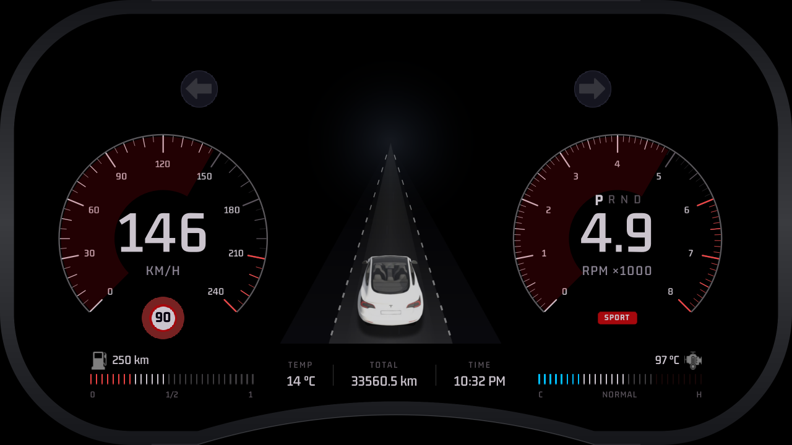

# QNX Digital Cluster

Qt Quick instrument cluster for the QNX guest on the NXP i.MX8QM, rendering
to display 4 via GPU1.



## Features

- **Speedometer and tachometer** — live speed, RPM, gear and drive mode
- **Road view** — car, lane markings and speed streaks, animated from the
  real vehicle speed; stationary when the car is stopped
- **Turn indicators** — driven by the steering-wheel paddles (`BTN_L3` /
  `BTN_R3`), one side cancelling the other like a real stalk
- **Fault popups** — engine DTCs raised by the TC397, shown severity-first
  with the affected system, dismissed from the wheel
- **Bottom bar** — fuel, ambient and engine temperature, odometer, clock
- **Content views** — car, Android map mirror, contacts, music, fuel and
  settings, cycled from the wheel D-pad
- **Speed-limit badge** with over-speed warning

## Communication

| Source | Transport | Carries |
|---|---|---|
| Android navigation | TCP `6200` (HNCL) | destination, distance, active view |
| Android map | TCP `6201` (HNMF) | map frames for the mirrored view |
| Android media | TCP `6300` (HNMC) | now-playing state for MusicView |
| Steering wheel | UDP `8888` | `BTN_UP/DOWN/LEFT/RIGHT/OK/L3/R3` |
| Vehicle gateway | `/tmp/fuel.txt`, `/tmp/env_temp.txt` | TC397 sensor values |
| Vehicle gateway | `/tmp/dtc.txt` | active fault bitmask |
| Telemetry | `telemetry.json` | speed, RPM, gear |

All TCP transports are independent — the cluster is a server, Android
connects as a client, and each one failing leaves the rest running. File
inputs are polled at 20 Hz and are flat in `/tmp` because the guest's
filesystem implements neither `mkdir()` nor `rename()`.

Override paths without rebuilding:

```bash
HNC_TELEMETRY_PATH=/tmp/telemetry.json   # telemetry source
HNC_WHEEL_PORT=8888                      # steering-wheel UDP port
```

## Build for QNX

Needs QNX SDP 8.0 and Qt 6.10.2 for `qnx_aarch64`.

```bash
source ~/qnx800/qnxsdp-env.sh

rm -rf build-qnx
mkdir build-qnx
cd build-qnx

~/Qt/6.10.2/qnx_aarch64/bin/qt-cmake .. \
    -DCMAKE_BUILD_TYPE=Release

cmake --build . --parallel 8
```

Produces `build-qnx/QnxClusterApp`, an aarch64 ELF for the QNX guest.

Reconfigure from scratch (`rm -rf build-qnx`) whenever a QML file, C++ source
or `.qrc` entry is added — QML is compiled into the binary, so no QML change
can be tested without rebuilding and redeploying.

### Toolchain

`qt-cmake` from the `qnx_aarch64` kit already carries the QNX toolchain, so
the command above needs nothing further.

`toolchain/qnx.nto.toolchain.cmake` is included for plain-CMake components
that are built without Qt (the vehicle gateway service uses it). It reads
`QNX_HOST` and `QNX_TARGET` from the environment — both are set by
`qnxsdp-env.sh` — and targets `aarch64le` with `qcc`:

```bash
source ~/qnx800/qnxsdp-env.sh
cmake -S . -B build-qnx \
    -DCMAKE_TOOLCHAIN_FILE=toolchain/qnx.nto.toolchain.cmake
```

## Run on the guest

```bash
export LD_LIBRARY_PATH=/qt/lib:/proc/boot:/lib:/usr/lib:/lib/dll:/lib/dll/pci:/opt/someip/libs:/usr/lib/graphics/iMX8QM
export QT_PLUGIN_PATH=/qt/plugins
export QML_IMPORT_PATH=/qt/qml
export QT_QUICK_CONTROLS_STYLE=Basic

QnxClusterApp
```

Useful flags: `--simulate` drives the gauges from a synthetic sweep instead of
live telemetry, `--no-splash` skips the startup animation, and
`--swap-interval 2` halves the render rate on a 60 Hz display.

## Documentation

- `METHODOLOGY.md` — how this UI was rebuilt and how performance is measured
- `PLAN.md` — the staged build-up and what each stage cost
